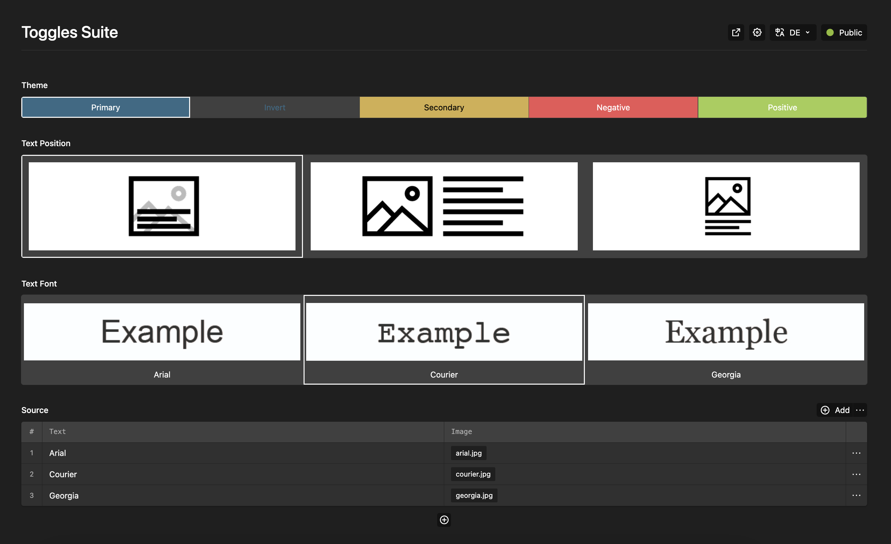

# Plain Toggles Suite Plugin for Kirby CMS




Extends the [Kirby Toggles Field](https://getkirby.com/docs/reference/panel/fields/toggles) with colors, images and many more.

## Installation

**Manually**

[Download](https://github.com/plain-solutions-gmbh/kirby-toggles-suite) and unzip the content into your plugin folder: `/site/plugins/`

**With Composer**

```bash
composer require plain/kirby-toggles-suite
```

# Examples

## Manual Options

```yaml

label: Theme
type: toggles
options:
  - text: Primary
    value: primary
    color: '#356A86'
  - text: Secondary
    value: secondary
    color: '#D3AF4C'
  - text: Negative
    value: negative
    color: '#FFFFFF'
    background: '#EC5555'
  - text: Positive
    value: positive
    color: '#FFFFFF'
    background: '#A3CD4F'

```


## Query Options

```yml

label: Theme
type: toggles
options:
  type: query
  query: site.colors.tostructure
  text: '{{ item.label }}'
  value: '{{ item.class }}'
  color: '{{ item.invert }}'
  background: '{{ item.default }}'
  icon: alpha

```

# License

By using this project, you agree to the terms and conditions outlined in our [Terms of Service](https://plain-solutions.net/terms). 

To acquire a license for this project, please visit our [Licensing Page](https://plain-solutions.net/906069).